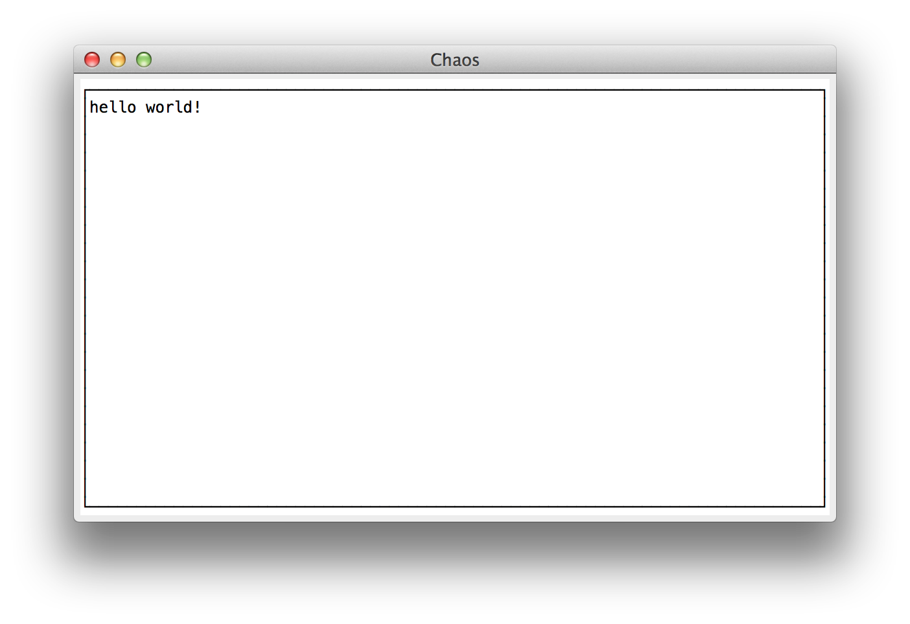
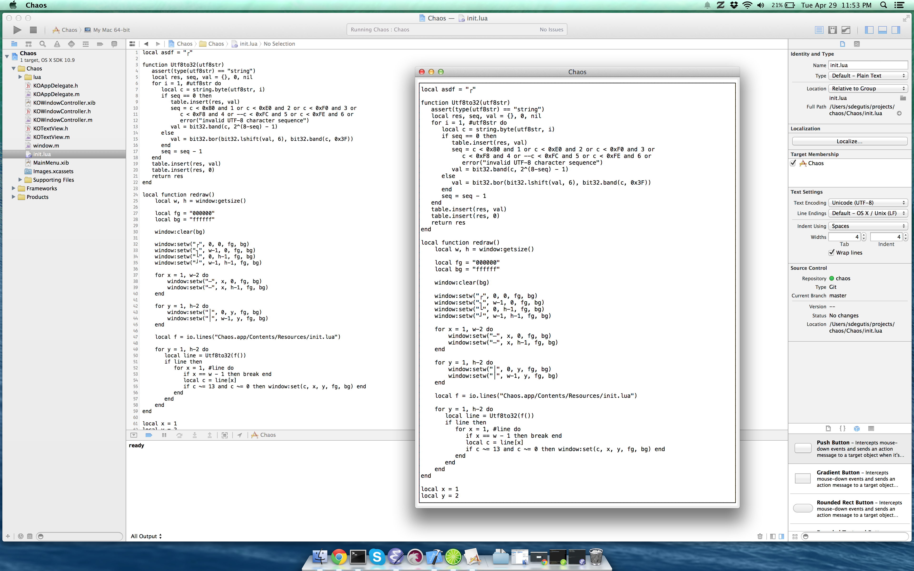

### Chaos

Source to this screenshot: [init.lua](https://github.com/sdegutis/chaos/blob/2dcaf408287553f7ec24ca0d859ac6492d71ef6d/Chaos/init.lua)

#### What is it?

Chaos.app is basically just a grid of characters, with a Lua API.

Why, you ask? Well, I wanted to write a text editor. Like, a
super-flexible one. One that anyone can modify /entirely/ without
having to recompile anything.

But for the sake of fighting Wirth's law, I figured I'd do a throwback
to 1978. So it's nothing fancy. There's no embedded WebKit. No fancy
animations or bleeding-edge UI. Just a grid of characters. Because
honestly, I'd take flexibility and efficiency over fanciness any day.

So Chaos just makes a grid, and loads init.lua (and eventually also a
user-defined config, probably in `~/.chaos/init.lua`).

This Lua file has access to a `window` instance. You can register your
Lua callbacks for the "key pressed" event (which has full key and
modifier info) and "window resized" event. You can clear the whole
screen with a given background color, and set a given grid cell to a
given char, fg color, and bg color. That's all.

#### But why Lua?

1. It's so small of a language that I can literally just throw its
   entire source code right into this project.
2. It's super fast. Like, way fast. For serious.
3. It's a really simple language. And simplicity is my favorite thing
   ever lately.
4. It's not that bad, really. Sure, there are a few weird things, but
   they're minor.

#### Example

Here's a quine: [init.lua](https://github.com/sdegutis/chaos/blob/87f9177f4ee030ab931199b8a4b5f983017d0283/Chaos/init.lua)

