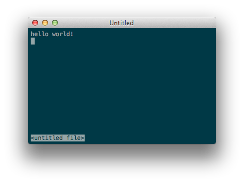

### Chaos

A hackable text editor for the 22nd century.

#### Start hacking it

Chaos's API uses [Lua](http://phrogz.net/lua/LearningLua_FromJS.html).

At launch-time, it reads `~/.chaos/init.lua`, which can require several
modules, most notably `window` and `devconsole`. API docs coming soon.
